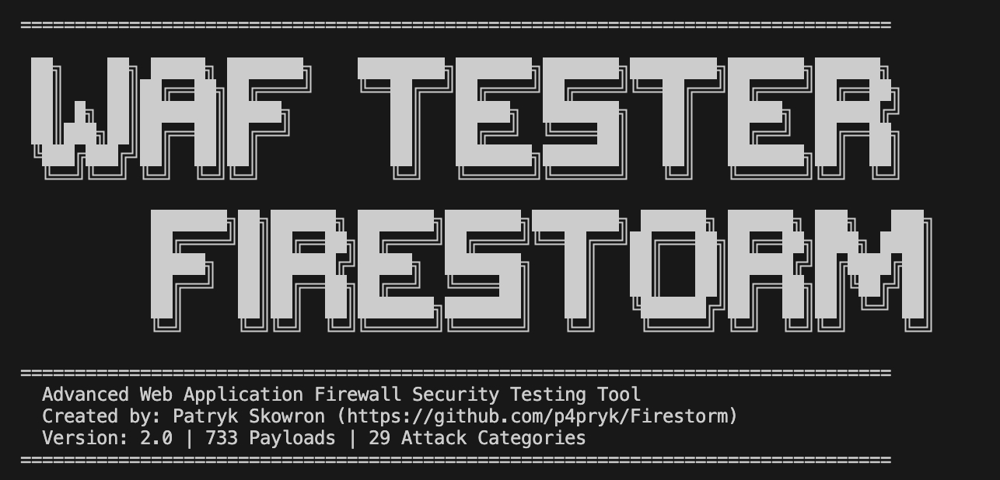

# FIRESTORM - Advanced WAF Security Testing Tool

**Created by Patryk Skowron** | [https://github.com/p4pryk/Firestorm](https://github.com/p4pryk/Firestorm)



A comprehensive Web Application Firewall (WAF) testing tool designed for security professionals, penetration testers, and DevSecOps teams. Firestorm delivers an extensive collection of 733 payloads across 29 attack categories to validate WAF effectiveness and identify security gaps.

---

## Key Features

- **Extensive Payload Library**: 733 carefully crafted attack payloads covering modern and legacy vulnerabilities
- **29 Attack Categories**: From SQL injection to AI/LLM prompt injection, including cloud-specific attacks
- **WAF Fingerprinting**: Automatic detection of 12 major WAF solutions (Cloudflare, Akamai, AWS WAF, Azure WAF, F5, Imperva, Fortinet, Barracuda, Sucuri, ModSecurity, Wordfence, Palo Alto)
- **Multiple Delivery Methods**: GET/POST parameters, JSON/XML bodies, HTTP headers, cookies, URL paths
- **89 Unique Security Headers**: Comprehensive header-based attack testing
- **Custom Block Detection**: Configure custom HTTP status codes for WAF block detection
- **Detailed Reporting**: CSV export with full payload details, response codes, and vulnerability indicators
- **Professional Output**: Clear categorization of blocked, passed, and error results

---

## Installation

### Requirements

- Python 3.7 or higher
- pip (Python package manager)

### Setup

1. Clone the repository:
```bash
git clone https://github.com/p4pryk/Firestorm.git
cd Firestorm
```

2. Install dependencies:
```bash
pip install -r requirements.txt
```

Or use the provided bash script (creates virtual environment):
```bash
chmod +x run.sh
./run.sh --host example.com
```

---

## Usage

### Basic Usage

Test a target website:
```bash
python main.py --host example.com
```

Test with specific port:
```bash
python main.py --host example.com --port 8080
```

### Advanced Options

Skip WAF fingerprinting phase:
```bash
python main.py --host example.com --skip-waf-detection
```

Define custom WAF block status codes:
```bash
python main.py --host example.com --block-status 403,418,444
```

Disable CSV report generation:
```bash
python main.py --host example.com --no-csv
```

### Command-Line Parameters

| Parameter | Description | Default |
|-----------|-------------|---------|
| `--host` | Target hostname or IP address (required) | - |
| `--port` | Target port number | 80 |
| `--block-status` | Custom HTTP status codes indicating WAF block (comma-separated) | 401,403,406,429 |
| `--skip-waf-detection` | Skip automatic WAF fingerprinting | false |
| `--no-csv` | Disable CSV report generation | false |

---

## Attack Categories

Firestorm tests the following attack vectors:

1. **SQL Injection** - Database manipulation and data exfiltration
2. **Cross-Site Scripting (XSS)** - JavaScript injection and DOM manipulation
3. **Path Traversal / LFI** - File system access and information disclosure
4. **Remote File Inclusion / SSRF** - External resource access and metadata service abuse
5. **Command Injection** - OS command execution and RCE
6. **LDAP Injection** - Directory service manipulation
7. **NoSQL Injection** - NoSQL database bypass techniques
8. **GraphQL Injection** - API introspection and batching attacks
9. **Prototype Pollution** - JavaScript object manipulation
10. **XXE (XML External Entity)** - XML parser exploitation
11. **Deserialization** - Unsafe object deserialization attacks
12. **Server-Side Template Injection (SSTI)** - Template engine exploitation
13. **CRLF Injection** - HTTP response splitting
14. **Open Redirect** - URL redirection vulnerabilities
15. **JWT Attacks** - Token manipulation and algorithm confusion
16. **XML Injection** - XPath and XQuery injection
17. **HTTP Request Smuggling** - Request splitting and cache poisoning
18. **CORS Bypass** - Cross-origin resource sharing exploitation
19. **Web Cache Poisoning** - Cache manipulation attacks
20. **Log4j / Spring4Shell** - Critical RCE vulnerabilities
21. **IDOR (Insecure Direct Object Reference)** - Access control bypass
22. **Cookie Injection** - Cookie-based attacks
23. **JSON Body Attacks** - API parameter manipulation
24. **XML Body Attacks** - SOAP and XML-based exploitation
25. **HTTP Header Attacks** - Header injection and smuggling
26. **Cloud Provider Attacks** - AWS, Azure, GCP metadata service abuse
27. **WebSocket / HTTP/2 Attacks** - Modern protocol exploitation
28. **API Security** - REST, GraphQL, OpenAPI vulnerabilities
29. **Modern 2025 Attacks** - AI/LLM prompt injection, vector database attacks

---

## Understanding Test Results

### Result Categories

**BLOCKED**: WAF successfully detected and blocked the attack payload. Indicates proper WAF protection.

**PASSED**: Payload successfully reached the application (HTTP 2xx/3xx). This indicates a POTENTIAL VULNERABILITY that requires immediate investigation.

**ERROR**: Request failed due to client/server errors (HTTP 4xx/5xx excluding WAF blocks). Not a security vulnerability.

**SKIPPED**: Payload could not be tested (e.g., requires raw socket access for HTTP smuggling).

### WAF Effectiveness Score

Firestorm calculates a WAF effectiveness score based on the block rate:

- **STRONG** (80%+): WAF blocks most attack payloads
- **MODERATE** (50-79%): WAF provides partial protection, gaps exist
- **WEAK** (<50%): Significant security gaps, WAF ineffective

Block Rate = Blocked Payloads / (Blocked + Passed) × 100%

---

## Example Output

```text
================================================================================

 ██╗    ██╗ █████╗ ███████╗    ████████╗███████╗███████╗████████╗███████╗██████╗ 
 ██║    ██║██╔══██╗██╔════╝    ╚══██╔══╝██╔════╝██╔════╝╚══██╔══╝██╔════╝██╔══██╗
 ██║ █╗ ██║███████║█████╗         ██║   █████╗  ███████╗   ██║   █████╗  ██████╔╝
 ██║███╗██║██╔══██║██╔══╝         ██║   ██╔══╝  ╚════██║   ██║   ██╔══╝  ██╔══██╗
 ╚███╔███╔╝██║  ██║██║            ██║   ███████╗███████║   ██║   ███████╗██║  ██║
  ╚══╝╚══╝ ╚═╝  ╚═╝╚═╝            ╚═╝   ╚══════╝╚══════╝   ╚═╝   ╚══════╝╚═╝  ╚═╝

            ███████╗██╗██████╗ ███████╗███████╗████████╗ ██████╗ ██████╗ ███╗   ███╗
            ██╔════╝██║██╔══██╗██╔════╝██╔════╝╚══██╔══╝██╔═══██╗██╔══██╗████╗ ████║
            █████╗  ██║██████╔╝█████╗  ███████╗   ██║   ██║   ██║██████╔╝██╔████╔██║
            ██╔══╝  ██║██╔══██╗██╔══╝  ╚════██║   ██║   ██║   ██║██╔══██╗██║╚██╔╝██║
            ██║     ██║██║  ██║███████╗███████║   ██║   ╚██████╔╝██║  ██║██║ ╚═╝ ██║
            ╚═╝     ╚═╝╚═╝  ╚═╝╚══════╝╚══════╝   ╚═╝    ╚═════╝ ╚═╝  ╚═╝╚═╝     ╚═╝
    
================================================================================
  Advanced Web Application Firewall Security Testing Tool
  Created by: Patryk Skowron (https://github.com/p4pryk/Firestorm)
  Version: 2.0 | 733 Payloads | 29 Attack Categories
================================================================================

📋 TARGET INFORMATION
================================================================================
   Target URL:    http://example.com:80/
   Total Payloads: 733
   Categories:     29
   Block Codes:    [401, 403, 406, 429]
================================================================================

[*] Starting WAF fingerprinting...

================================================================================
🛡️  WAF DETECTION PHASE
================================================================================

✅ WAF DETECTED: 2 system(s) identified
   Confidence Level: HIGH

   🔹 Cloudflare
      → Matched: header:cf-ray
      → Matched: body:cloudflare
```

================================================================================

================================================================================
OVERALL RESULT
================================================================================
  Total payloads:    733
  Blocked by WAF:    687 (WAF detected attack)
  PASSED (2xx):      28  POTENTIAL VULNERABILITIES!
  Errors (4xx/5xx):  15 (request failed)
  Skipped:           3 (not testable)

  WAF Block Rate:    96.1% (blocked / (blocked + passed))
  WAF Strength:      STRONG
================================================================================
```

---

## CSV Report Structure

Generated CSV reports contain the following fields:

- **category**: Attack category (e.g., sqli, xss)
- **name**: Payload identifier
- **payload_value**: Actual payload sent (truncated to 500 chars)
- **method**: Delivery method (GET, POST-json, POST-form, GET+Header, etc.)
- **status**: HTTP response code
- **result**: Test result (blocked, passed, error, skipped)
- **reason**: Detailed reason for the result
- **response_body**: Server response (truncated to 1000 chars)

---

## Delivery Methods

Firestorm tests payloads using multiple delivery vectors:

1. **GET Query Parameters** - Standard URL parameters (`?q=payload`)
2. **POST Form Data** - application/x-www-form-urlencoded
3. **POST JSON Body** - application/json content
4. **POST XML Body** - application/xml content (SOAP, XXE)
5. **URL Path** - Payload injected directly into URL path
6. **Cookie Header** - Payload sent via Cookie header
7. **Custom HTTP Headers** - 89 unique headers tested (X-Forwarded-For, User-Agent, Authorization, etc.)

---

## Security Considerations

**IMPORTANT**: This tool is designed for authorized security testing only.

- Only test systems you own or have explicit written permission to test
- Unauthorized testing may be illegal in your jurisdiction
- Some payloads may trigger security alerts or IDS/IPS systems
- Use responsibly and in accordance with applicable laws and regulations

---

## Technical Details

### WAF Detection Signatures

Firestorm can identify the following WAF solutions:

- Cloudflare (cf-ray, cf-cache-status headers)
- Akamai (akamai-grn, x-akamai-request-id headers)
- Imperva/Incapsula (x-iinfo, incap_ses cookie)
- F5 BIG-IP (x-wa-info, bigipserver cookie)
- AWS WAF (x-amzn-requestid, x-amzn-waf headers)
- Azure WAF (x-azure-ref, x-ms-request-id headers)
- Fortinet FortiGate (x-fortinet-id header)
- Barracuda (barra_counter_session header)
- Sucuri (x-sucuri-id header)
- ModSecurity (x-mod-security header)
- Wordfence (response body signatures)
- Palo Alto (response body signatures)

### Payload Statistics

- **Total Payloads**: 733
- **Categories**: 29
- **Header-Based Payloads**: 133 (89 unique headers)
- **Largest Category**: SQL Injection (60 payloads)
- **Modern Attack Coverage**: AI/LLM, cloud metadata, GraphQL, WebSocket

---

## Contributing

Contributions are welcome! To contribute:

1. Fork the repository
2. Create a feature branch (`git checkout -b feature/new-payloads`)
3. Commit your changes (`git commit -am 'Add new XSS payloads'`)
4. Push to the branch (`git push origin feature/new-payloads`)
5. Open a Pull Request

### Contribution Guidelines

- Add unique, original payloads not already covered
- Include descriptions for new attack categories
- Follow existing code style and structure
- Test payloads against known WAF solutions
- Update documentation accordingly

---

## License

This project is licensed under the MIT License. See [LICENSE](LICENSE) file for details.

---

## Disclaimer

This tool is provided for educational and authorized security testing purposes only. The author assumes no liability for misuse or damage caused by this program. Users are responsible for complying with all applicable local, state, national, and international laws. Always obtain proper authorization before testing any systems you do not own.

---

## Changelog

### Version 2.0 (2025)
- Added 733 comprehensive payloads (29 categories)
- Implemented WAF fingerprinting for 12 major solutions
- Added 89 unique header-based attack vectors
- Introduced custom block status code detection
- Enhanced reporting with CSV export
- Added modern attack categories (AI/LLM, cloud, API)
- Improved payload delivery methods (7 vectors)
- Professional output formatting

---

## Contact

**Author**: Patryk Skowron  
**GitHub**: [https://github.com/p4pryk/Firestorm](https://github.com/p4pryk/Firestorm)

For bug reports, feature requests, or security concerns, please open an issue on GitHub.

---

**FIRESTORM** - Testing Web Application Firewalls, One Payload at a Time
